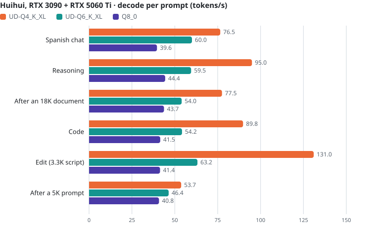
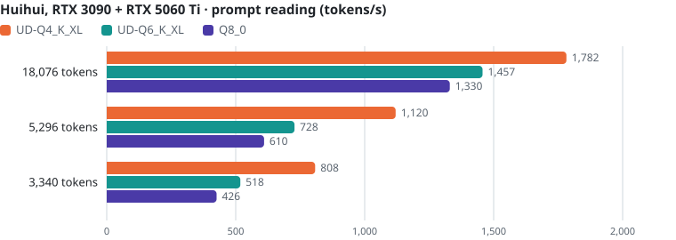
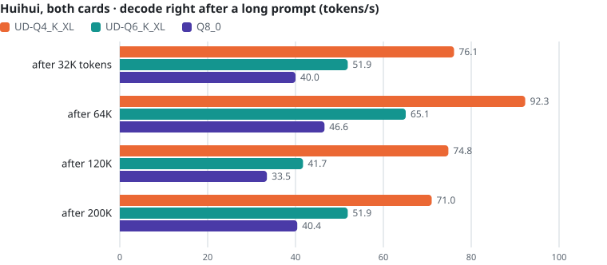
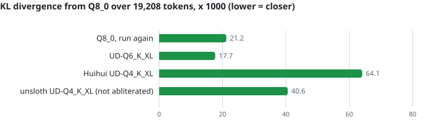

<h1 align="center">Strata en un Ryzen 7 5700X + RTX 3090 + RTX 5060 Ti</h1>

<p align="center"><b>Qwen3.8-Flash-Next 125B (MoE) en un PC de escritorio: 93 tokens/s con una RTX 3090 y 116 tokens/s con una RTX 5060 Ti al lado</b><br>
UD-IQ4_XS y UD-Q4_K_XL de unsloth · 128 GB DDR4 · Linux · <a href="README.md">in English</a></p>

Esta es la rama `custom` de [eddoursul/Strata](https://github.com/eddoursul/Strata), un fork de
[Niko1221/Strata](https://github.com/Niko1221/Strata) afinado para una RTX 3090 con una segunda gráfica como nivel de
expertos, más algunos arreglos y varios cambios recientes del motor original (entre ellos la caché K/V elástica de la
0.1.40), medida en un solo equipo con una gráfica y con dos. El README original de Strata (qué es, instalación, todas las opciones) está en
[STRATA-README.md](STRATA-README.md).

<picture>
  <source media="(prefers-color-scheme: dark)" srcset="docs/media/readme/summary-dark.svg">
  
</picture>

| Generación, tokens/s | RTX 3090 | RTX 3090 + RTX 5060 Ti | con la segunda gráfica |
|---|---:|---:|---:|
| UD-IQ4_XS | **92,9** | **116,4** | +25 % |
| UD-Q4_K_XL | **71,2** | **86,4** | +21 % |

## El equipo

| | |
|---|---|
| CPU | AMD Ryzen 7 5700X: 8 núcleos / 16 hilos, Zen 3, AVX2 (sin AVX-512) |
| RAM | 128 GB DDR4-3200 CL22 (4 x 32 GB), ~36 GB/s de lectura (STREAM) |
| Gráfica principal | NVIDIA RTX 3090 24 GB, PCIe 4.0 x8, límite de potencia 250 W |
| Segunda gráfica (nivel de expertos) | NVIDIA RTX 5060 Ti 16 GB, PCIe 4.0 x8, límite de potencia 150 W |
| Disco | NVMe Crucial P3 Plus 2 TB |
| Software | Linux (kernel 7.2), driver NVIDIA 615.71, CUDA 13.4, motor compilado para `86;120` |

Con las gráficas a su potencia de serie (350 W y 180 W) las velocidades fueron las mismas: al motor lo limitan la CPU,
la RAM y el PCIe, no la potencia de las gráficas.

## Los modelos

Qwen3.8-Flash-Next tiene 48 capas de 512 expertos. Strata guarda los expertos en RAM, mantiene en VRAM los más usados
(una caché adaptativa) y calcula el resto en la CPU, así que la RAM, la CPU y el enlace PCIe marcan la velocidad.

| | UD-IQ4_XS | UD-Q4_K_XL |
|---|---|---|
| Ficheros GGUF de unsloth | 3 | 4 |
| Pesos de los expertos | 55,4 GiB | 71,7 GiB |
| Formatos de los expertos (gate/up · down) | IQ3_S (47 capas), IQ4_XS (1) · IQ4_NL (43), Q8_0 (5) | Q4_K (47), Q5_K (1) · Q5_1 (43), Q8_0 (5) |
| RAM que ocupa el motor | ~58 GiB | ~81 GB |
| Kernels de CPU de los expertos | limitados por cálculo: escalan con los núcleos | limitados por ancho de banda: la DDR4 se satura con ~4 núcleos |

Los dos van con 200.192 tokens de contexto, caché KV int8 que solo ocupa VRAM según crece la conversación
(`--kv-grow`: mientras tanto la caché de expertos guarda ~1.000 expertos más), la capa de borrador MTP con vocabulario
español y búsqueda en el prompt, y verificación greedy: la especulación nunca cambia la salida.

## Una gráfica o dos

La RTX 5060 Ti guarda ~14,5 GB más de expertos y calcula su parte de cada capa mientras la CPU calcula la suya.
Las cifras con dos gráficas se midieron de nuevo el 2026-10-10 con el motor actual, en el que además la tarjeta
principal calcula por PCIe un cuarto de los fallos de la CPU (`--pcie-frac 0.25`: +1-2 %); dos rondas cada una, y la
lectura del prompt, la mediana de cuatro. Las de una gráfica, prompts largos y 64 GB son las del 06-10: sin sus
opciones nuevas, el motor da desde entonces la misma salida.

<picture>
  <source media="(prefers-color-scheme: dark)" srcset="docs/media/readme/decode-iq4xs-dark.svg">
  
</picture>

<picture>
  <source media="(prefers-color-scheme: dark)" srcset="docs/media/readme/decode-q4kxl-dark.svg">
  
</picture>

La lectura del prompt (prefill) gana con la segunda gráfica en los prompts cortos; uno de 18K lo limita el enlace x8 de
la 3090 en los dos casos.

<picture>
  <source media="(prefers-color-scheme: dark)" srcset="docs/media/readme/prefill-iq4xs-dark.svg">
  
</picture>

<picture>
  <source media="(prefers-color-scheme: dark)" srcset="docs/media/readme/prefill-q4kxl-dark.svg">
  
</picture>

Aquí UD-IQ4_XS es el más rápido (+30 % con una gráfica, +35 % con dos): sus expertos ocupan menos, así que caben más
en VRAM (84 % / 91 % de aciertos frente a 81 % / 85 %), y sus kernels de CPU, limitados por cálculo, aprovechan los
siete workers. UD-Q4_K_XL es el cuantizado más grande y de más precisión.

## Prompts largos

Prompts de 32K a 200K tokens distintos (prosa, luego la documentación y el código de este repositorio) con 128 tokens
de respuesta. La lectura del prompt se mantiene en 2.200-2.500 tokens/s en las cuatro configuraciones hasta el contexto
de 200.192 tokens: un prompt de 200K tarda 84-91 s antes del primer token. La K/V crece con el prompt (llega al
contexto entero cediendo ~450 ranuras de expertos), y con la segunda gráfica UD-IQ4_XS sigue generando a ~97 tok/s
incluso a 200K.

<picture>
  <source media="(prefers-color-scheme: dark)" srcset="docs/media/readme/longctx-iq4xs-dark.svg">
  
</picture>

<picture>
  <source media="(prefers-color-scheme: dark)" srcset="docs/media/readme/longctx-q4kxl-dark.svg">
  
</picture>

| Prompt | Tiempo de lectura (las cuatro) | Generación después: UD-IQ4_XS 1 / 2 GPU | UD-Q4_K_XL 1 / 2 GPU |
|---|---:|---:|---:|
| 32.022 tokens | 13-14 s | 73,5 / 94,7 | 58,6 / 83,0 |
| 64.022 tokens | 26-27 s | 93,6 / 99,9 | 77,0 / 90,0 |
| 120.019 tokens | 48-51 s | 66,2 / 98,1 | 48,4 / 69,8 |
| 200.019 tokens | 84-91 s | 60,0 / 97,3 | 41,6 / 74,0 |

La generación tras un prompt largo sale de 128 tokens, así que varía más de una ronda a otra que las medias de los seis textos.

## Sesiones largas de agente

18 turnos a través del servidor de Niko1221/Strata (el que se usa aquí, ver [el servidor](#el-servidor)), como los
mandaría un agente de programación: ficheros de código pegados, documentación, cambios de tema, la conversación
creciendo hasta ~31K tokens y 600 tokens por respuesta. Con una gráfica: **UD-IQ4_XS 86,2 tok/s**, UD-Q4_K_XL
64,5 tok/s (una ronda cada uno; antes de la K/V elástica y el pool fusionado 78,1 y 59,9; con 64 GB de RAM, más abajo).

## Con 64 GB de RAM

El mismo PC con el motor limitado a 60 GiB (lo que deja libre un PC de 64 GB) con un cgroup de systemd
(`MemoryMax=60G`): cuentan en él la memoria del motor y la caché de disco de los ficheros del modelo que lee. UD-IQ4_XS
(55,4 GiB de expertos) sigue cabiendo, justo en el límite. UD-Q4_K_XL (71,7 GiB) no: va con un pack con `experts.bin`
(`iq_pack.py --experts-bin`) y `--mmap-experts`, y lee del NVMe los expertos que le faltan; ahí `--kv-grow` se apaga
solo.

<picture>
  <source media="(prefers-color-scheme: dark)" srcset="docs/media/readme/ram64-dark.svg">
  
</picture>

| Generación, tokens/s | 128 GB | 64 GB |
|---|---:|---:|
| UD-IQ4_XS, RTX 3090 | 92,9 | 92,7 (2 rondas: 92,6-92,7) |
| UD-IQ4_XS, las dos gráficas | 116,3 | 115,7 (2 rondas: 114,8-116,7) |
| UD-Q4_K_XL, RTX 3090 | 71,2 | 25,9 (1 ronda) |
| UD-Q4_K_XL, las dos gráficas | 84,9 | 39,7 (1 ronda) |

- UD-IQ4_XS va ahora con 64 GB igual que con 128 GB, también al leer prompts (antes de la K/V elástica y el pool
  fusionado perdía ahí un 2-4 %).
- **Con 64 GB, usa `--prompt-cache 4`** (el motor trae 16 por defecto): cada punto de control de la caché de prompts
  ocupa ~112 MiB de RAM, y en una sesión de agente 16 de ellos pasaron a UD-IQ4_XS del límite.
- UD-Q4_K_XL lo limita el NVMe (un Crucial P3 Plus) y varía mucho de una sesión a otra.

<picture>
  <source media="(prefers-color-scheme: dark)" srcset="docs/media/readme/decode-iq4xs-64-dark.svg">
  
</picture>

<picture>
  <source media="(prefers-color-scheme: dark)" srcset="docs/media/readme/decode-q4kxl-64-dark.svg">
  
</picture>

<picture>
  <source media="(prefers-color-scheme: dark)" srcset="docs/media/readme/prefill-iq4xs-64-dark.svg">
  
</picture>

<picture>
  <source media="(prefers-color-scheme: dark)" srcset="docs/media/readme/prefill-q4kxl-64-dark.svg">
  
</picture>

Prompts largos con 64 GB (una ronda cada uno): tiempo de lectura del prompt y generación justo después. Los de
UD-Q4_K_XL son del motor anterior a la K/V elástica y el pool fusionado (un prompt de 200K tardó 43,8 min; no se ha
repetido):

| Prompt | UD-IQ4_XS, RTX 3090 | UD-IQ4_XS, las dos | UD-Q4_K_XL, RTX 3090 | UD-Q4_K_XL, las dos |
|---|---:|---:|---:|---:|
| 32.022 tokens | 13,4 s · 75,1 | 13,4 s · 101,4 | 42,7 s · 17,8 | 44,1 s · 33,1 |
| 64.022 tokens | 26,3 s · 95,0 | 25,6 s · 97,7 | 2,7 min · 22,9 | 1,7 min · 50,0 |
| 120.019 tokens | 50,3 s · 64,9 | 48,1 s · 105,6 | 4,6 min · 2,7 | 72,1 s · 50,2 |
| 200.019 tokens | 88,3 s · 59,4 | 83,3 s · 98,2 | 43,8 min · 6,0 | 2,0 min · 8,2 |

- UD-IQ4_XS lee los prompts largos tan rápido como con 128 GB, y con las dos gráficas sigue generando a ~98-106 tok/s
  después.
- UD-Q4_K_XL vuelve a leer sus expertos del NVMe en cada bloque de 32K de un prompt: con 64 GB no sirve para contextos
  largos.

Sesiones de agente con 64 GB (los mismos 18 turnos, `--prompt-cache 4`, una ronda cada una): UD-IQ4_XS 85,6 tok/s
(128 GB: 86,2), UD-Q4_K_XL 30,7 tok/s (128 GB: 64,5).

Con 64 GB, el que conviene es UD-IQ4_XS; UD-Q4_K_XL pide un PC de 96 GB o más (~81 GB para el motor más el sistema).

## Lo que han aportado los cambios sobre `custom` de eddoursul

<picture>
  <source media="(prefers-color-scheme: dark)" srcset="docs/media/readme/steps-dark.svg">
  
</picture>

- El **kernel IQ4_XS AVX-2 multi-token** (#415 del motor original): la única capa IQ4_XS ya no va token a token.
- El **gather AVX2 de la tabla de IQ3_S** (motor original, `STRATA_IQ256_GATHER=1`): da exactamente los mismos números,
  +4,9 % en Zen 3. En el original es opcional porque la velocidad del gather depende de la CPU.
- **`--adapt-decay 0.92`** (opción del motor original; 0,7 por defecto): la caché de VRAM recuerda más tiempo qué
  expertos se usaron. En las sesiones de agente los tres pasos dieron 75,0 -> 77,8 (+3,7 %).
- **La K/V elástica (`--kv-grow`)**, portada de la 0.1.40 del original: la K/V de 200K de contexto (2,6 GiB en int8)
  ya no ocupa VRAM desde el arranque; la caché de expertos usa esas ~1.000 ranuras hasta que una conversación necesita
  las celdas. Los dos últimos pasos se midieron uno frente a otro en la misma sesión (82,5 -> 90,9 -> 92,9; la base de
  los pasos anteriores dio 83,6 el día antes).
- **El pool de CPU fusionado (`STRATA_POOL_FUSED=1`)**, a partir de Hardin22/Strata-DualGPU: gate/up y down de una capa
  en un solo lote, así que los núcleos ya no se esperan entre las dos mitades. Las mismas operaciones, +2-4 % en todas
  las configuraciones.

<picture>
  <source media="(prefers-color-scheme: dark)" srcset="docs/media/readme/decay-dark.svg">
  
</picture>

Dos rondas por valor, medidas antes de la K/V elástica y el pool fusionado (0,92 daba entonces 83,6). A 0,99 la caché
apenas sigue ya el texto, y el 1,0 ahora se rechaza (PR #591). Con la segunda gráfica 0,92 anulaba la ganancia del gather, y en UD-Q4_K_XL no
aportaba en las sesiones de agente, así que esas configuraciones se quedan en 0,7.

Los arreglos, propuestos a eddoursul/Strata: el arreglo del bloqueo con dos gráficas del #2, de FlareP1, y
[una continuación](https://github.com/eddoursul/Strata/pull/2) para el congelamiento de la caché que provoca con 6 o
más workers (ya forma parte del #2); `--mmap-experts` con packs nativos ([#5](https://github.com/eddoursul/Strata/pull/5)); un worker por
núcleo físico en Linux ([#6](https://github.com/eddoursul/Strata/pull/6)); que el motor salga en cuanto recibe `QUIT`
([#7](https://github.com/eddoursul/Strata/pull/7)); el vocabulario de borrador en español
([#8](https://github.com/eddoursul/Strata/pull/8); también al original, hecho con su propia herramienta:
[Niko1221/Strata#1186](https://github.com/Niko1221/Strata/pull/1186), el archivo que se publica ahora aquí: la mitad de
ids, la misma aceptación).

### Añadidos posteriores (de pull requests abiertos del motor original)

- **Bloques q8_1 siempre finitos** (#606 y PR #838 del original, en los cinco cuantizadores de este fork): una
  activación enorme podía convertir en infinito la escala o la suma fp16 de un bloque, luego en NaN, y el modelo se
  quedaba repitiendo un token. Los mismos bits en todo bloque normal, sin coste de velocidad.
- **El gather AVX2 reorganizado** (PR #863 de Hardin22): UD-IQ4_XS con la 3090 83,1 -> 83,6 tok/s (cinco rondas), con las dos
  108,0 -> 109,4 (cuatro rondas). Su camino de un solo token para IQ3_S sigue apagado en AMD, donde el dot de ggml aún es
  algo más rápido para un token (0,322 frente a 0,334 ms por experto en el 5700X).
- **Un cuantizador AVX2 de activaciones Q8_K** (PR #851 de Hardin22): los mismos bytes que el de ggml; aquí no se nota.
- **`--adapt-decay` fuera de (0, 1) rechazado** (PR #591). UD-Q4_K_XL no cambia con ninguno de los cuatro.

### Y de la 0.1.40 del original y de otros forks

- **La K/V elástica** (2fbe321 del original, `--kv-grow`): la K/V y la zona de la caché de expertos son rangos de
  memoria virtual de CUDA; cuando una petición necesita más celdas, las ranuras justo por debajo del préstamo del
  prefill ceden sus expertos (antes, uno más usado pasa a la ranura más fría del préstamo) y sus trozos de 2 MiB se
  mapean en la K/V; una petición corta posterior los devuelve. Creciendo con VRAM libre da los mismos tokens bit a bit
  que sin ella (también con la caché de prompts guardando y restaurando conversaciones intercaladas); ceder ranuras
  solo pasa expertos de la GPU a la CPU, como hace la caché adaptativa en cada ventana. El límite de las ranuras que
  puede tomar es el préstamo más grande del prefill (sus buffers crecen con los expertos que la caché no guarda). Con
  `--mmap-experts` queda apagada, como en el original.
- **Las subidas de la tabla de residencia esperan a su copia** (#1001 del original): una carrera rara podía hacer que
  un experto lo calcularan la GPU y la CPU a la vez, o ninguna.
- **Un arranque más rápido en Linux** (a partir de he-be/Strata 32f8912, de masahiro hibi): `cudaHostAlloc` ponía a
  cero y fijaba en memoria los 55 GiB de expertos en un solo hilo antes de leerlos (~16 s). Ahora la zona es memoria
  normal que los hilos de la carga llenan con `preadv`, directamente en el sitio de cada experto (sin copia
  intermedia), y cada capa se fija con `cudaHostRegister` en cuanto se ha leído. UD-IQ4_XS en la RTX 3090 está lista
  en 38-43 s desde el disco (antes 52-55 s) y en 14-17 s con el GGUF en la caché de páginas (33-50 s); con las dos
  tarjetas, 22-24 s (50-53 s); con 64 GB, 38-40 s (55 s), sin pasar nada a swap; y se cierra en 2 s (6 s). Los mismos
  bytes (`STRATA_LOAD_VERIFY=1` vuelve a leer cada experto y lo compara con el fichero), los mismos tokens y la misma
  velocidad. `STRATA_PIN_AFTER_COPY=0` vuelve al camino anterior.
- Probado y descartado: el decodificado escalar de IQ3_S del PR #930 del original (mismos bits y un 14 % más rápido en
  un hilo con un token, pero nada en el motor: con ocho hilos manda la RAM; sus interruptores quedan, apagados),
  `--no-second-gpu-adapt` de guthirry (sin cambio) y las cachés K/V de 4 bits (`k8v4`, `q4_0`: pierden algo de
  precisión).

## Un modelo cuyos expertos no caben en RAM: Q8_0, y un UD-Q6_K_XL hecho a partir de él

El Qwen3.8-Flash-Next abliterated de huihui-ai en Q8_0 tiene 119,5 GiB de expertos; sin nada cargado, este equipo
tiene ~120 GiB disponibles. Dos opciones nuevas dejan los expertos más usados del perfil **solo en VRAM**:
`--vram-pin-gib G` pone los primeros G GiB en las ranuras más bajas de la caché de la gráfica principal y
`--second-gpu-pin-gib G` los siguientes (los que la segunda gráfica cogería primero) en las suyas. Nada los expulsa,
los presta a la ruta del prompt ni los cede a la K/V elástica; una gráfica los calcula siempre que se enrutan; el
arena de la RAM no los carga y se leen del GGUF directamente a su ranura. La gráfica principal sigue teniendo los
mismos expertos que sin fijar, los más calientes. Al arrancar, el motor rechaza los tamaños que chocarían con los
préstamos de la ruta del prompt o con la K/V y dice cuánto bajarlos. Sin las opciones nada cambia (los mismos bytes,
comprobado); con ellas y las cachés a tamaño fijo, las respuestas son los mismos bytes que sin fijar
(`--adapt-every 0`). El GGUF re-partido del Q8_0 de Huihui necesitó además que el cargador aceptase el nombre de la
arquitectura en todos los trozos.

Con 11 + 11 GiB fijos el motor ocupa ~97,5 GiB de RAM y quedan ~19 libres, suficiente para una caché de prompts de
32 checkpoints y 10 GiB de conversaciones aparcadas (llenada de verdad: siempre quedaron al menos 6 GiB libres).

huihui-ai no publica un Q6, así que se ha hecho aquí desde el Q8_0 con llama.cpp y la receta del UD-Q6_K_XL de
unsloth (Q6_K para los expertos gate/up de 47 capas, todo lo demás como en el Q8_0) y su imatrix; lleva la
abliteración del Q8_0:

```
llama-quantize --allow-requantize --imatrix imatrix_unsloth.gguf --keep-split --tensor-type-file types.txt \
  Qwen3.8-Flash-Next-Q8_0-00001-of-00006.gguf Qwen3.8-Flash-Next-UD-Q6_K_XL.gguf Q8_0 16
# types.txt, una por línea: blk\.2\.ffn_gate_exps=q8_0  blk\.2\.ffn_up_exps=q8_0  ffn_gate_exps=q6_k  ffn_up_exps=q6_k
#                           indexer\.k_proj=bf16  indexer\.q_proj=bf16  ple_conv1d=f32
```

Sus 101,7 GiB de expertos caben en RAM, pero fijar expertos sigue compensando porque lee menos de ella: 54,2, 55,9 y
54,7 tok/s con 0, 6 y 11 GiB por gráfica. Los ajustes del Q8_0 ya eran sus mejores: `--pcie-frac` 0,15 o 0,35,
`--spec-min-p` 0,7 o 0,9, 12 MB de precarga en la segunda gráfica, cinco workers y el 35 % o el 55 % de la cabeza en
la segunda gráfica quedaron todos a menos de un 2 % (dos rondas de la base difirieron un 1,2 %).

| Huihui, RTX 3090 + RTX 5060 Ti | UD-Q4_K_XL | UD-Q6_K_XL | Q8_0 |
|---|---:|---:|---:|
| Expertos solo en VRAM | - | 6 + 6 GiB | 11 + 11 GiB |
| Generación, media de seis prompts | 84,0 tok/s | **55,9 tok/s** | 41,8 tok/s |
| Sesión de agente (18 pasos) | 84,6 tok/s | 57,7 tok/s | 44,6 tok/s |
| Lectura de un prompt de 18K / 200K | 1.782 / 2.284 tok/s | 1.457 / 2.109 tok/s | 1.330 / 2.057 tok/s |
| Perplejidad, 19.208 tokens en evaluación forzada (español, documentación en inglés, código) | 4,860 | 4,965 | 4,932 |
| KL frente al Q8_0 en ellos (x 1000) · mismo token más probable | 64,1 · 91,2 % | **17,7 · 95,1 %** | 21,2 · 94,8 % (otra ejecución) |
| Perplejidad, 2.304 tokens de texto español reservado (evaluación forzada) | 4,515 | - | **4,480** |
| 50 problemas difíciles (40 de matemáticas y lógica, 10 de programación; respuestas calculadas por código) | 43/50 | 40/50 | 40/50 |
| 24 problemas de matemáticas y lógica, 4 de programación | 24/24, 4/4 | - | 24/24, 4/4 |

<picture>
  <source media="(prefers-color-scheme: dark)" srcset="docs/media/readme/q8-decode-dark.svg">
  
</picture>

<picture>
  <source media="(prefers-color-scheme: dark)" srcset="docs/media/readme/q8-prefill-dark.svg">
  
</picture>

<picture>
  <source media="(prefers-color-scheme: dark)" srcset="docs/media/readme/q8-longctx-dark.svg">
  
</picture>

El Q8_0 genera a la mitad de velocidad que UD-Q4_K_XL sea cual sea el prompt: a diferencia de UD-Q4_K_XL, no gana
nada con los borradores aceptados (el texto de edición), porque cada token de más trae sus propios expertos de la RAM.
UD-Q6_K_XL queda donde lo pone la RAM: las dos gráficas sirven el 87,8 % de los expertos enrutados de UD-Q4_K_XL, el
76,6 % de los de UD-Q6_K_XL y el 68,1 % de los del Q8_0, y cada fallo pesa más, así que por token UD-Q6_K_XL lee de la
RAM ~2,9 veces y el Q8_0 ~4,4 veces lo que lee UD-Q4_K_XL; un tiempo fijo de las gráficas más ese tiempo de RAM,
ajustado con UD-Q4_K_XL y el Q8_0, predice 55 tok/s para UD-Q6_K_XL, que da 56. Los prompts largos los leen casi igual
de rápido (2.057-2.292 tok/s; uno de 200K en 95 s UD-Q6_K_XL y en 97 s el Q8_0, frente a 88), porque la ruta del
prompt calcula todos los expertos en las gráficas; una ronda de UD-Q6_K_XL tardó 119 s en el de 200K y no volvió a
pasar al repetirla con contadores del sistema (la repetición del Q8_0: 97,4 s frente a 97,2). Generación: dos rondas
cada uno (tres UD-Q6_K_XL); prompts largos: una ronda (dos UD-Q6_K_XL; 128 tokens de respuesta, así que varían más);
lectura del prompt: la mediana de cuatro (UD-Q4_K_XL), tres (UD-Q6_K_XL) y ocho (Q8_0) rondas.

La generación del Q8_0 la limita la RAM: con las dos gráficas llenas, cada token lee ~1 GB de expertos de la DDR4
(43 GB/s medidos), así que ganaron los ajustes que leen menos de ella: `--pcie-frac 0.25` (+5 %), `--spec-min-p 0.8`
(borradores solo cuando son probables, +2,6 %) y `--feed-max 128` (los prompts cortos por las ventanas de
verificación: la primera palabra de un chat corto a los 2,0 s en vez de ~2,9). Adaptar menos a menudo, menos
cambios, sin búsqueda en el prompt, sin precarga, más workers, una caché de filas PLE mayor y menos reserva de VRAM
(sin memoria) fueron más lentos o no más rápidos.

Calidad sobre 19.208 tokens en evaluación forzada, en una sola secuencia (tres artículos en español reservados, dos
enciclopédicos, dos documentos técnicos en inglés, C++ y Python): UD-Q6_K_XL está tan cerca del Q8_0 como otra
ejecución del propio Q8_0 (KL 0,018 frente a 0,021; el mismo token más probable el 95,1 % de las veces frente al
94,8 %), con una perplejidad un 0,7 % mayor (+0,0067 ± 0,0017 nats por token). UD-Q4_K_XL de Huihui está más lejos
(KL 0,064; 91,2 %) y aun así predice este texto un 1,5 % mejor, y UD-Q4_K_XL de unsloth, sin abliterar, un 1,1 %
mejor. UD-Q4_K_XL de Huihui es un híbrido: solo sus tensores Q8_0 (los 96 densos que cambia la abliteración y los
expertos down de cinco capas) difieren de los de unsloth, así que es otro modelo y no un Q8_0 más basto, y la
abliteración parece costar más perplejidad que los expertos de 4 bits. En el español reservado, el Q8_0 sigue por
delante de él (+0,3 % aquí, +0,8 % en los 2.304 tokens de la tabla). En los 50 problemas difíciles las diferencias son
ruido: todos los fallos menos uno se quedaron sin sus 8.000 tokens de razonamiento, y la única respuesta equivocada fue
del Q8_0 (14.453 días en vez de 14.454).

<picture>
  <source media="(prefers-color-scheme: dark)" srcset="docs/media/readme/q6-quality-dark.svg">
  
</picture>

- **Las fuerzas de abliteración no se pueden mezclar.** En los 96 tensores densos, el Q8_0 lleva ~0,51 de la
  abliteración de UD-Q4_K_XL de Huihui (la dirección singular principal de cada diferencia). Subir los densos del Q6
  a la de UD-Q4_K_XL dejando sus expertos con la del Q8_0 lo rompió: ~150 de los 19.208 tokens entre 2 y 7 nats peor,
  +0,04 nats en total, descartadas antes todas las rutas del motor; el Q6 se queda con la abliteración del Q8_0.

- **Enrutado hacia expertos residentes** (5df35dcb del original y #1737 de aly8246, opcional con
  `STRATA_ROUTE_RESIDENT=<margen>`), portado al router fusionado de este fork y contando también los expertos de la
  segunda gráfica (lo que duplica los fallos que quita): los puestos 6-9 de los 10 elegidos que ninguna gráfica tiene
  pasan al mejor experto que sí tenga una, si está dentro del margen. En el Q8_0 da +34 % con margen 0,25 y +55 % con
  0,5, pero cuesta tanta calidad como bajar a UD-Q4_K_XL (+0,008 nats por token, KL 0,024-0,038 frente a 0,006 entre
  dos ejecuciones normales; incluso con 0,1: +0,005, KL 0,014), así que queda apagado.

<picture>
    <source media="(prefers-color-scheme: dark)" srcset="docs/media/readme/q8-quality-dark.svg">
    
  </picture>
- **Descuantización Q8_0 coalescida** para las proyecciones densas de la ruta del prompt (#1720 de eelgaev en el
  original): los mismos bits (`dequant_q8_0_identity` compara BF16, FP16 y FP32 con el kernel anterior), de 5 a 6 veces
  más rápida en ese kernel en la 3090 (BF16, FP16 y FP32).
- Las líneas de `--window-logits` terminan con la log-probabilidad del token emitido (`@`), para las evaluaciones
  forzadas.

## Workers de CPU

<picture>
  <source media="(prefers-color-scheme: dark)" srcset="docs/media/readme/workers-dark.svg">
  
</picture>

Descomprimir los expertos de UD-IQ4_XS cuesta (búsquedas en tablas, ~5 GB/s por núcleo), así que cada núcleo suma hasta
los siete que puede dar la CPU (uno es el hilo principal del motor). Los de UD-Q4_K_XL se descomprimen rápido y cuatro
núcleos ya leen la RAM tan deprisa como da (de 3 a 6 da lo mismo). Dos rondas por punto, medidas antes de la K/V
elástica y el pool fusionado.

## Ajustes y cómo usarlo

| | UD-IQ4_XS 1 GPU | UD-IQ4_XS 2 GPU | UD-Q4_K_XL 1 GPU | UD-Q4_K_XL 2 GPU |
|---|---:|---:|---:|---:|
| `--pool-workers` | 7 | 7 | 4 | 4 |
| `--adapt-swaps` | 192 | 192 | 96 | 96 |
| `--adapt-decay` | 0,92 | 0,7 | 0,7 | 0,7 |
| `STRATA_IQ256_GATHER` | 1 | 1 | - | - |
| `--pcie-frac` (kernel) | 0 | 0 | 0,3 | 0 |
| `--kv-grow` | sí | sí | sí | sí |
| `STRATA_POOL_FUSED` | 1 | 1 | 1 | 1 |

Las cuatro configuraciones y los pasos para compilar y arrancarlas en Linux: [examples/r7-5700x](examples/r7-5700x/).

### El servidor

El `serve/server.py` de este repositorio es el de eddoursul. Aquí el motor lo sirve **el servidor de Niko1221/Strata**
(su `main`, probado en `v0.1.41`), que funciona con este motor tal cual y corrige dos cosas que el anterior hace mal:

- un mensaje con el texto de un token de control (`<|im_end|>`, `<|im_start|>`, `<think>`...) se codifica como texto:
  un agente que lee un fichero que los contiene ya no corta ahí su turno, y un documento no puede colar un turno de
  sistema (#931);
- una `<tool_call>` que el modelo escribe de ejemplo (en un bloque de código, en su respuesta) es texto, no una
  llamada (#1058).

Reutiliza el contexto de una conversación igual que el anterior (las mismas sesiones de agente releen los mismos
~31K tokens).

    git clone https://github.com/Niko1221/Strata ../Strata-niko-server
    .venv/bin/python ../Strata-niko-server/serve/server.py --engine strata \
        --config examples/r7-5700x/ud-iq4_xs-3090.json --port 8092

Se arranca desde la carpeta de este repositorio (las rutas de las configuraciones son relativas a ella). Sin clave de
API responde a los nombres de este PC y a direcciones IP; para entrar con otro nombre de host (uno de tu red local o
tu VPN, por ejemplo), hay que añadirlo en `"allowed_hosts"` de la configuración.

## Cómo se ha medido

- Seis textos fijos, casi todos en español: una pregunta de chat (400 tokens de respuesta), un problema de razonamiento
  (700, con razonamiento), un documento de 18.076 tokens para resumir (400), una tarea de código (600), un script de
  3.340 tokens devuelto editado (~2.600) y un prompt de 5.296 tokens (256). Los textos largos son notas privadas y no
  se publican.
- El motor directamente por su protocolo `--serve`, sin caché de prompt, greedy, con especulación. La velocidad de
  generación es la media geométrica de los seis textos; cada configuración es la media de dos rondas (a menos de un
  1,5 % entre sí), intercaladas con la base al comparar versiones. Las sesiones de agente pasan por el servidor de
  Niko1221/Strata.
- Tablas completas: [docs/MEASUREMENTS.es.md](docs/MEASUREMENTS.es.md).
